# Battleship Game Algorithms

This repository contains various algorithms that are used for solving a variation of the Battleship game. Each algorithm follows a specific strategy, from brute force to greedy algorithms, to calculate optimal moves or to analyze the current game state.

## Scripts Included

### Task3.py

This script is responsible for finding feasible ship placements and their likelihood on the game board. It includes several algorithms:

- **GetShipPositions**: Calculates feasible ship placements on a game board. Time complexity: O(S*C), where S is the number of potential ship shapes and C is the number of cells within
each shape..
- **GetShipConfigurationCount**: Calculates the likelihood of a cell containing a part of a ship. Time complexity: O(S * n^2 * P),P), where S is the number of ships, n
is the size of the board, and P is the maximum number of positions a ship can occupy.
- **GetHighestConfigCell**: Identifies the cell with the highest ship configuration count. Time complexity: O(n^2), n
is the size of the board.
- **GetAdjacentCells**: Identifies adjacent cells on a game board. Time complexity: O(1).
- **StrategyII Hunt & StrategyII-Target**: Makes the next move decision based on the highest configuration count and adjacency to previously hit cells. Time complexity: O(S * n^2 * P), where S is the number of ships, n is the size
of the board, and P is the maximum number of positions a ship can occupy.

### Task4.py

An application of Task 3 for a scenario where we are in target mode after a hit.

### Task5.py

This script identifies sunk ships by comparing the clusters of hit cells to the provided list of ships. It includes:

- **FindSunkShips**: Identifies clusters of hits, matches them to ships and confirms if the number of sunk ships matches with announced number. Time complexity: O(n^2 + m * p), where n is the board size, m is the number of clusters
(or sunk ships), and p is the number of ships.

### Task7.py

This script evaluates the status of ships on a game board. It includes:

- **find_clusters**: Identifies clusters of "hit" cells. Time complexity: O(n), where n is the total number of cells.
- **find_cluster_status**: Checks if a ship within a cluster has been entirely hit or not. Time complexity: O(n), where n is the total number of cells.
- **FindShipStatus**: Determines if all ships are sunk or identifies potential positions for remaining ship cells. Time complexity: O(n), where n is the total number of cells.

- **Testing**: 
The algorithms implemented in Task 7 have been tested against 44 different cases and have successfully passed all of them. This ensures their reliability and correctness when analyzing the Battleship game state.

- **Visualization**:
In addition to textual information, we also provide visual illustrations to better represent and understand the outcomes of our algorithms. These images depict various game states, specifically highlighting sunk and uncertain identification cases. The color-coded grids aid in understanding the distribution and position of the ships, and the decisions made by the algorithms. 

Please see the below images for a representation of these scenarios:

<table>
  <tr>
    <td>
      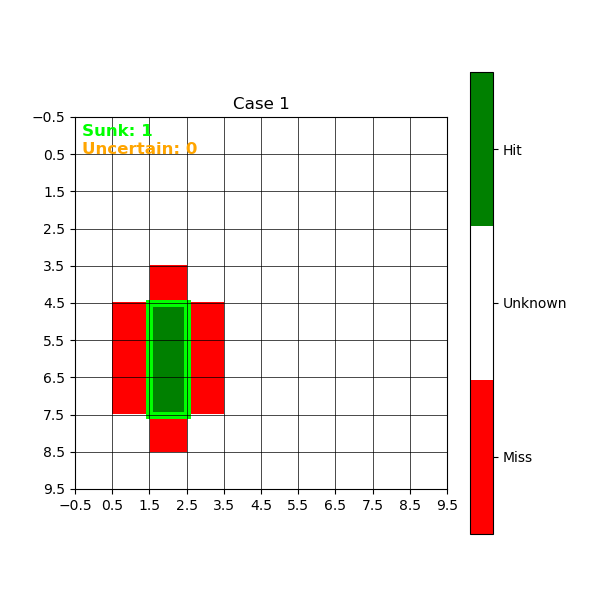
    </td>
    <td>
      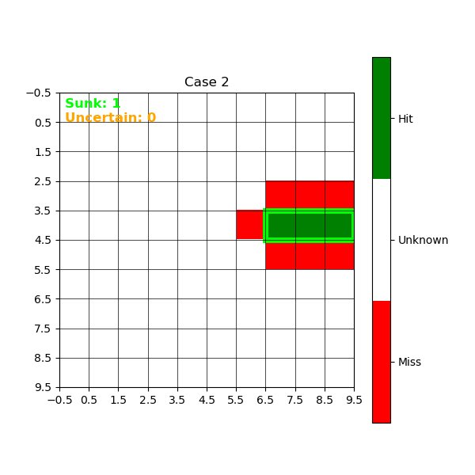
    </td>
    <td>
      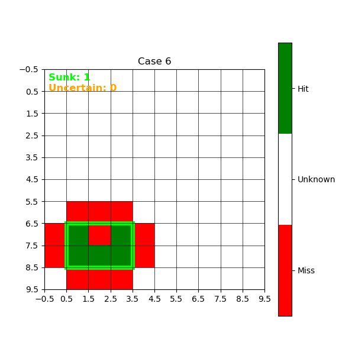
    </td>
  </tr>
  <tr>
    <td>
      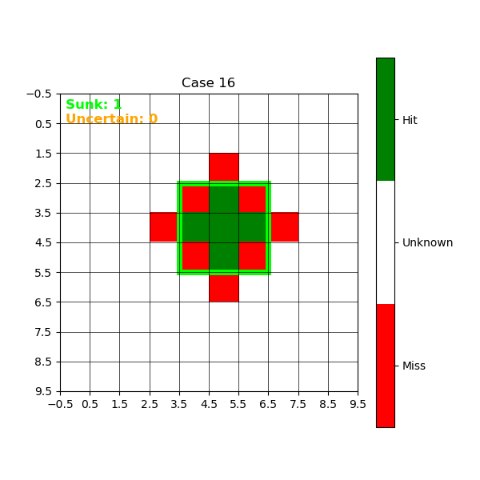
    </td>
    <td>
      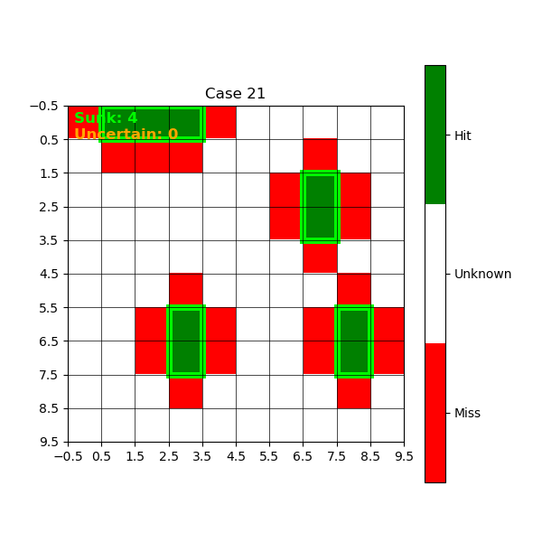
    </td>
    <td>
      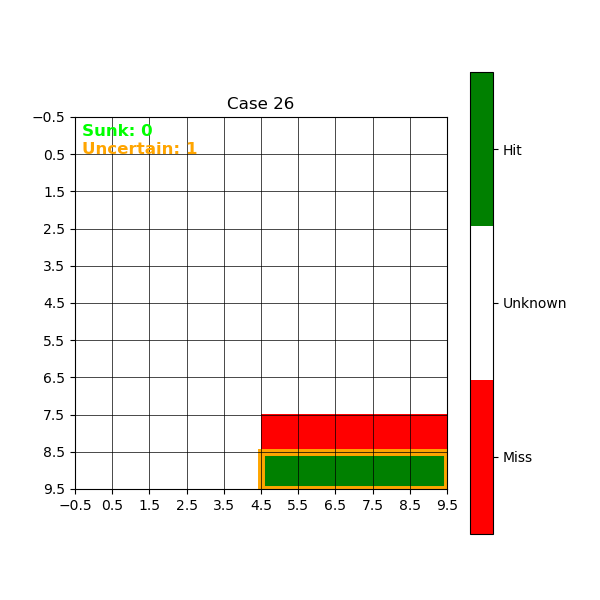
    </td>
  </tr>
  <tr>
    <td>
      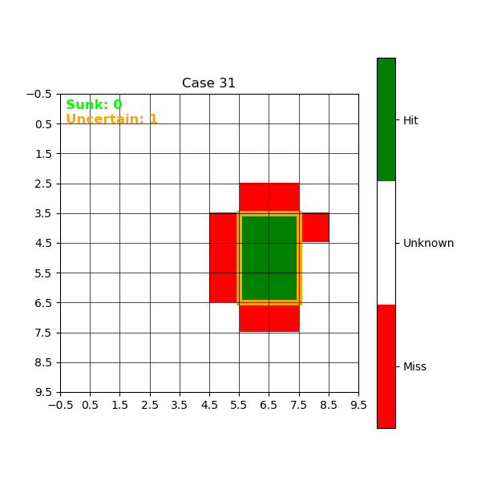
    </td>
    <td>
      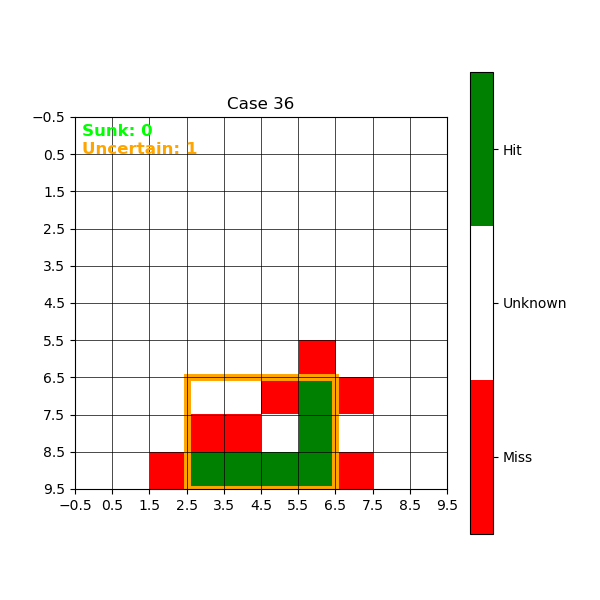
    </td>
    <td>
      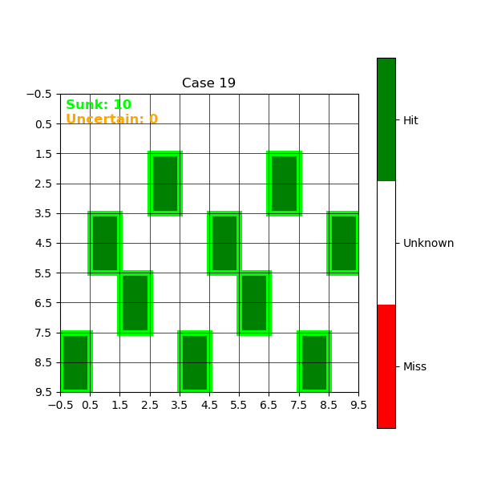
    </td>
  </tr>
  <tr>
    <td>
      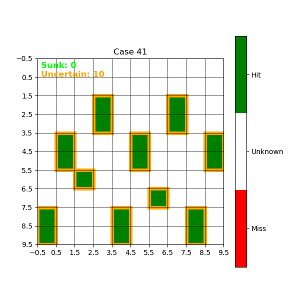
    </td>
    <td>
      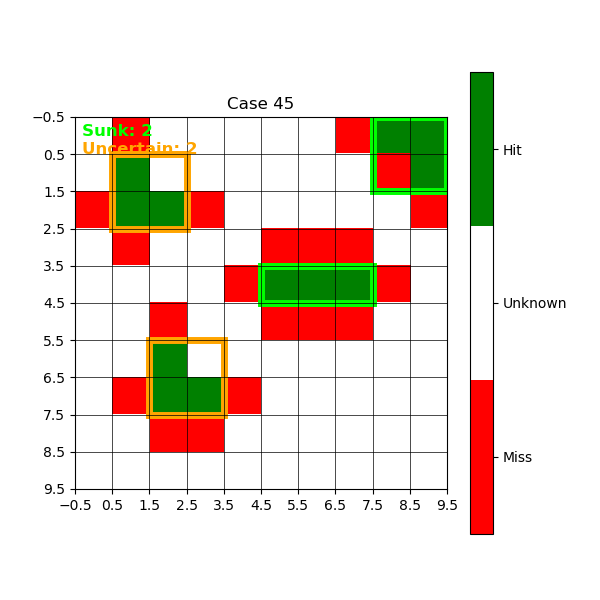
    </td>    
    <td>
      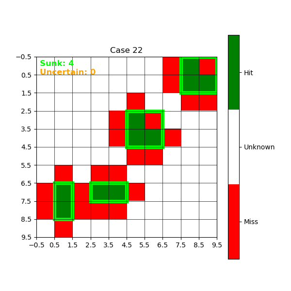
    </td>
  </tr>
</table>

